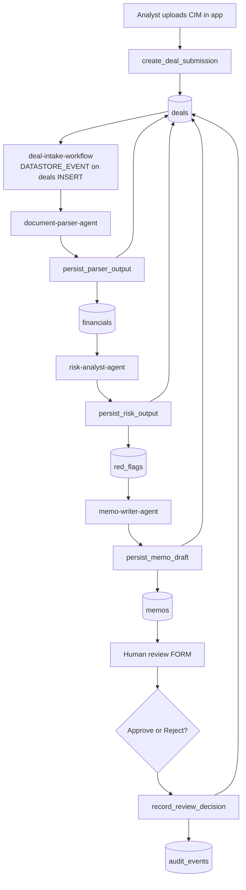
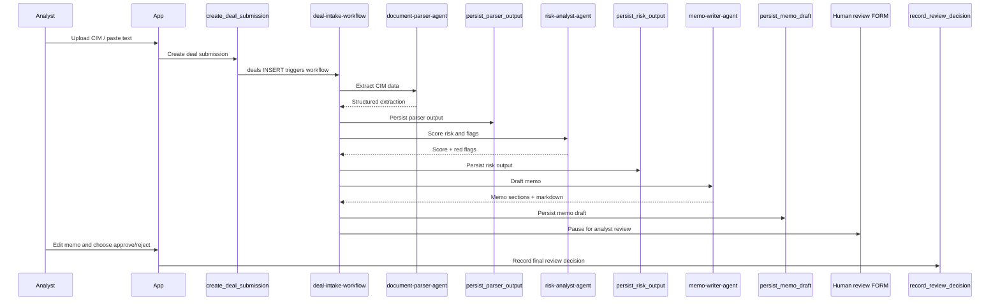
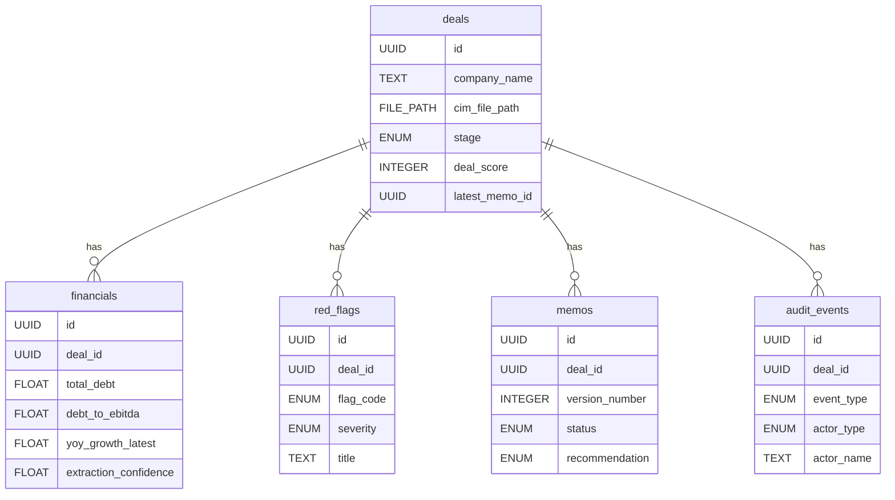
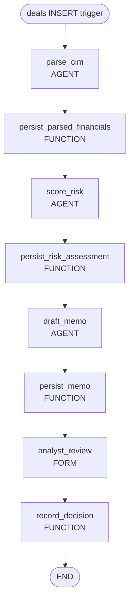
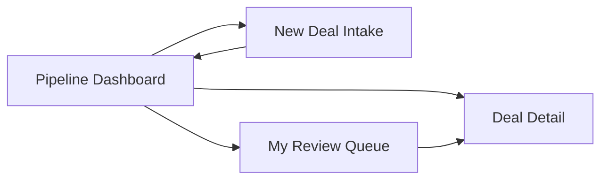

# Architecture

## AI Deal Room Operator

### One Line

Upload a CIM, get a draft investment memo in minutes, with a human analyst required to approve or reject before the deal advances.

---

## 1. Pod Scope

This pod supports one operating loop for private equity analysts doing first-pass CIM screening:

1. Analyst uploads or pastes a CIM.
2. The pod extracts structured company and financial data.
3. The pod scores risk and identifies red flags.
4. The pod drafts a one-page investment memo.
5. A human analyst reviews, edits, approves, or rejects.
6. Every step is logged in a shared audit trail.

This pod is intentionally:

- Not a CRM
- Not a portfolio monitoring system
- Not a deep-diligence workflow
- Not a fully autonomous investment decision engine

---

## 2. Design Principles

- Use Lemma Files as the source of truth for uploaded CIMs.
- Use shared tables for all deal data because deals are team-owned pipeline objects.
- Use agents only for judgment and drafting.
- Use functions for deterministic, coordinated writes.
- Use one workflow to orchestrate the sequence and human approval checkpoint.
- Use one app as the daily operating interface.
- Keep the design minimal: 3 agents, 1 workflow, 1 app, 5 shared tables, 5 functions.

---

## 3. High-Level Architecture



### Resource Interaction Diagram

```mermaid
flowchart LR
    subgraph Interface
      APP[Deal Room App]
    end

    subgraph Files
      FILES[/deal-room/cims]
    end

    subgraph Tables
      DEALS[(deals)]
      FIN[(financials)]
      FLAGS[(red_flags)]
      MEMOS[(memos)]
      AUDIT[(audit_events)]
    end

    subgraph Automation
      WF[deal-intake-workflow]
      A1[document-parser-agent]
      A2[risk-analyst-agent]
      A3[memo-writer-agent]
      F1[create_deal_submission]
      F2[persist_parser_output]
      F3[persist_risk_output]
      F4[persist_memo_draft]
      F5[record_review_decision]
    end

    APP --> F1
    F1 --> FILES
    F1 --> DEALS
    F1 --> AUDIT
    DEALS --> WF
    WF --> A1
    A1 --> FILES
    WF --> F2
    F2 --> FIN
    F2 --> DEALS
    F2 --> AUDIT
    WF --> A2
    A2 --> DEALS
    A2 --> FIN
    WF --> F3
    F3 --> FLAGS
    F3 --> DEALS
    F3 --> AUDIT
    WF --> A3
    A3 --> DEALS
    A3 --> FIN
    A3 --> FLAGS
    WF --> F4
    F4 --> MEMOS
    F4 --> DEALS
    F4 --> AUDIT
    APP --> F5
    F5 --> MEMOS
    F5 --> DEALS
    F5 --> AUDIT
```

### Workflow Sequence Diagram



---

## 4. File Model

### Shared folders

- `/deal-room/cims`
  - All uploaded CIM source documents.
  - PDF and text uploads live here.
  - Read by the parser agent.
  - Auto-indexed by Lemma for search and converted markdown.

- `/deal-room/memos`
  - Optional future folder for exported memo `.md` files.
  - Not required in v1 because the canonical memo lives in the `memos` table.

### File handling strategy

- The app uploads the CIM into `/deal-room/cims`.
- The `deals` table stores only the `cim_file_path`.
- The parser agent reads the pod file using Lemma's built-in converted markdown and page-scoped reading.
- No external parser service or custom document store is introduced.

---

## 5. Tables

All business tables are shared: `enable_rls: false`.

Reason: deals are team-visible pipeline entities, and the assigned analyst, reviewer, and workflow all need access to the same rows.

System columns `id`, `created_at`, and `updated_at` are omitted because Lemma adds them automatically.

### 5.1 `deals`

Purpose: the top-level pipeline record for one company opportunity and its current screening state.

```json
{
  "name": "deals",
  "enable_rls": false,
  "columns": [
    { "name": "deal_number", "type": "SERIAL", "auto": true, "unique": true },
    { "name": "company_name", "type": "TEXT", "required": true, "max_length": 240 },
    { "name": "source_type", "type": "ENUM", "required": true, "options": ["pdf_upload", "text_upload", "paste_in"] },
    { "name": "cim_file_path", "type": "FILE_PATH", "required": true, "max_length": 700 },
    { "name": "submitted_by_user_id", "type": "USER", "required": true },
    { "name": "assigned_analyst_user_id", "type": "USER", "required": true },
    { "name": "assigned_analyst_pod_member_id", "type": "UUID", "required": true },
    { "name": "stage", "type": "ENUM", "required": true, "default": "intake_pending", "options": ["intake_pending", "parsing", "risk_scoring", "memo_drafting", "awaiting_human_review", "under_review", "archived", "processing_failed"] },
    { "name": "parser_status", "type": "ENUM", "required": true, "default": "pending", "options": ["pending", "running", "completed", "failed"] },
    { "name": "risk_status", "type": "ENUM", "required": true, "default": "pending", "options": ["pending", "running", "completed", "failed"] },
    { "name": "memo_status", "type": "ENUM", "required": true, "default": "pending", "options": ["pending", "running", "draft_ready", "approved", "rejected", "failed"] },
    { "name": "deal_score", "type": "INTEGER" },
    { "name": "industry", "type": "TEXT", "max_length": 240 },
    { "name": "headquarters", "type": "TEXT", "max_length": 240 },
    { "name": "deal_size_ask", "type": "TEXT", "max_length": 240 },
    { "name": "business_model_summary", "type": "TEXT" },
    { "name": "management_team_summary", "type": "TEXT" },
    { "name": "company_key_risks_summary", "type": "TEXT" },
    { "name": "investment_recommendation", "type": "ENUM", "options": ["approve_deeper_diligence", "conditional", "reject"] },
    { "name": "workflow_run_id", "type": "UUID" },
    { "name": "latest_memo_id", "type": "UUID", "foreign_key": { "references": "memos.id" } },
    { "name": "last_reviewed_at", "type": "DATETIME" },
    { "name": "last_reviewer_user_id", "type": "USER" },
    { "name": "rejection_reason", "type": "TEXT" },
    { "name": "processing_error", "type": "TEXT" }
  ]
}
```

### 5.2 `financials`

Purpose: the structured extracted financial profile for a deal.

```json
{
  "name": "financials",
  "enable_rls": false,
  "columns": [
    { "name": "deal_id", "type": "UUID", "required": true, "foreign_key": { "references": "deals.id" } },
    { "name": "currency", "type": "TEXT", "max_length": 24 },
    { "name": "fiscal_year_1_label", "type": "TEXT", "max_length": 32 },
    { "name": "fiscal_year_1_revenue", "type": "FLOAT" },
    { "name": "fiscal_year_1_ebitda", "type": "FLOAT" },
    { "name": "fiscal_year_1_ebitda_margin", "type": "FLOAT" },
    { "name": "fiscal_year_2_label", "type": "TEXT", "max_length": 32 },
    { "name": "fiscal_year_2_revenue", "type": "FLOAT" },
    { "name": "fiscal_year_2_ebitda", "type": "FLOAT" },
    { "name": "fiscal_year_2_ebitda_margin", "type": "FLOAT" },
    { "name": "fiscal_year_3_label", "type": "TEXT", "max_length": 32 },
    { "name": "fiscal_year_3_revenue", "type": "FLOAT" },
    { "name": "fiscal_year_3_ebitda", "type": "FLOAT" },
    { "name": "fiscal_year_3_ebitda_margin", "type": "FLOAT" },
    { "name": "revenue_cagr_3y", "type": "FLOAT" },
    { "name": "yoy_growth_latest", "type": "FLOAT" },
    { "name": "total_debt", "type": "FLOAT" },
    { "name": "debt_to_ebitda", "type": "FLOAT" },
    { "name": "free_cash_flow", "type": "FLOAT" },
    { "name": "top_customer_name", "type": "TEXT", "max_length": 240 },
    { "name": "top_customer_revenue_pct", "type": "FLOAT" },
    { "name": "top_5_customers_revenue_pct", "type": "FLOAT" },
    { "name": "customer_concentration_summary", "type": "TEXT" },
    { "name": "management_background", "type": "TEXT" },
    { "name": "company_stated_risks", "type": "TEXT" },
    { "name": "extraction_confidence", "type": "FLOAT" },
    { "name": "missing_fields", "type": "JSON" },
    { "name": "source_page_map", "type": "JSON" }
  ]
}
```

### 5.3 `red_flags`

Purpose: one row per screening concern identified by the risk agent.

```json
{
  "name": "red_flags",
  "enable_rls": false,
  "columns": [
    { "name": "deal_id", "type": "UUID", "required": true, "foreign_key": { "references": "deals.id" } },
    { "name": "flag_code", "type": "ENUM", "required": true, "options": ["debt_to_ebitda_high", "customer_concentration_high", "margins_declining", "low_growth", "negative_cash_flow", "weak_management_team", "missing_key_data", "other"] },
    { "name": "severity", "type": "ENUM", "required": true, "options": ["low", "medium", "high"] },
    { "name": "title", "type": "TEXT", "required": true, "max_length": 240 },
    { "name": "reasoning", "type": "TEXT", "required": true },
    { "name": "metric_value", "type": "TEXT", "max_length": 120 },
    { "name": "threshold_value", "type": "TEXT", "max_length": 120 },
    { "name": "source_page_numbers", "type": "JSON" },
    { "name": "sort_order", "type": "INTEGER" },
    { "name": "is_active", "type": "BOOLEAN", "required": true, "default": true }
  ]
}
```

### 5.4 `memos`

Purpose: the memo draft and reviewed versions for a deal.

```json
{
  "name": "memos",
  "enable_rls": false,
  "columns": [
    { "name": "deal_id", "type": "UUID", "required": true, "foreign_key": { "references": "deals.id" } },
    { "name": "version_number", "type": "INTEGER", "required": true },
    { "name": "status", "type": "ENUM", "required": true, "default": "draft", "options": ["draft", "approved", "rejected", "superseded"] },
    { "name": "executive_summary", "type": "TEXT", "required": true },
    { "name": "financial_highlights", "type": "TEXT", "required": true },
    { "name": "risk_assessment", "type": "TEXT", "required": true },
    { "name": "recommendation", "type": "ENUM", "required": true, "options": ["approve_deeper_diligence", "conditional", "reject"] },
    { "name": "recommendation_reasoning", "type": "TEXT", "required": true },
    { "name": "body_markdown", "type": "TEXT", "required": true },
    { "name": "drafted_by_agent_name", "type": "TEXT", "required": true, "max_length": 120 },
    { "name": "edited_by_user_id", "type": "USER" },
    { "name": "approved_by_user_id", "type": "USER" },
    { "name": "approved_at", "type": "DATETIME" },
    { "name": "rejected_at", "type": "DATETIME" }
  ]
}
```

### 5.5 `audit_events`

Purpose: immutable audit log for agent activity, function commits, and human decisions.

```json
{
  "name": "audit_events",
  "enable_rls": false,
  "columns": [
    { "name": "deal_id", "type": "UUID", "required": true, "foreign_key": { "references": "deals.id" } },
    { "name": "event_type", "type": "ENUM", "required": true, "options": ["deal_created", "parser_started", "parser_completed", "parser_failed", "risk_started", "risk_completed", "risk_failed", "memo_started", "memo_drafted", "memo_failed", "review_requested", "memo_edited", "review_approved", "review_rejected", "stage_changed"] },
    { "name": "actor_type", "type": "ENUM", "required": true, "options": ["user", "agent", "function", "workflow", "system"] },
    { "name": "actor_name", "type": "TEXT", "required": true, "max_length": 240 },
    { "name": "event_summary", "type": "TEXT", "required": true },
    { "name": "event_payload", "type": "JSON" },
    { "name": "related_memo_id", "type": "UUID", "foreign_key": { "references": "memos.id" } }
  ]
}
```

### Table Relationship Diagram



---

## 6. Agents

All three agents should use `output_schema` and remain judgment-only. They should not write directly to tables. Persistence should happen in functions.

### 6.1 `document-parser-agent`

#### Role

Read the uploaded CIM and extract the structured company and financial profile needed for first-pass screening.

#### Toolsets

- `POD`

#### Required grants

- Folder read: `/deal-room/cims`

#### Input

```json
{
  "deal_id": "UUID",
  "cim_file_path": "FILE_PATH",
  "company_name_hint": "string|null"
}
```

#### Output

```json
{
  "company_name": "string",
  "industry": "string|null",
  "headquarters": "string|null",
  "deal_size_ask": "string|null",
  "business_model_summary": "string",
  "management_team_summary": "string",
  "management_background": "string",
  "company_stated_risks": "string",
  "currency": "string|null",
  "fiscal_year_1_label": "string|null",
  "fiscal_year_1_revenue": "number|null",
  "fiscal_year_1_ebitda": "number|null",
  "fiscal_year_1_ebitda_margin": "number|null",
  "fiscal_year_2_label": "string|null",
  "fiscal_year_2_revenue": "number|null",
  "fiscal_year_2_ebitda": "number|null",
  "fiscal_year_2_ebitda_margin": "number|null",
  "fiscal_year_3_label": "string|null",
  "fiscal_year_3_revenue": "number|null",
  "fiscal_year_3_ebitda": "number|null",
  "fiscal_year_3_ebitda_margin": "number|null",
  "revenue_cagr_3y": "number|null",
  "yoy_growth_latest": "number|null",
  "total_debt": "number|null",
  "debt_to_ebitda": "number|null",
  "free_cash_flow": "number|null",
  "top_customer_name": "string|null",
  "top_customer_revenue_pct": "number|null",
  "top_5_customers_revenue_pct": "number|null",
  "customer_concentration_summary": "string|null",
  "extraction_confidence": "number",
  "missing_fields": ["string"],
  "source_page_map": "object"
}
```

#### System prompt strategy

- State explicitly that pod files are searchable and fully readable via converted markdown.
- Instruct the agent to read the converted markdown of the CIM and use page ranges when needed.
- Tell it to prefer explicit figures from the document over inferred numbers.
- Tell it to return `null` for unknown or low-confidence numeric fields.
- Require page-citation support in `source_page_map` for key extractions.
- Require `missing_fields` for anything not confidently found.

#### Boundaries

- Never write to tables.
- Never produce investment judgment.
- Only extract and summarize the document.

### 6.2 `risk-analyst-agent`

#### Role

Apply screening judgment to the extracted profile and output a score plus ranked red flags.

#### Toolsets

- `POD`

#### Required grants

- Table read: `deals`
- Table read: `financials`

#### Input

```json
{
  "deal_id": "UUID"
}
```

#### Output

```json
{
  "deal_score": "integer",
  "investment_recommendation": "approve_deeper_diligence|conditional|reject",
  "company_key_risks_summary": "string",
  "red_flags": [
    {
      "flag_code": "debt_to_ebitda_high|customer_concentration_high|margins_declining|low_growth|negative_cash_flow|weak_management_team|missing_key_data|other",
      "severity": "low|medium|high",
      "title": "string",
      "reasoning": "string",
      "metric_value": "string|null",
      "threshold_value": "string|null",
      "source_page_numbers": ["integer"]
    }
  ]
}
```

#### System prompt strategy

- Frame the agent as a first-pass PE screening analyst.
- Tell it to read the `deals` and `financials` rows for the `deal_id`.
- Give explicit scoring anchors:
  - Debt / EBITDA above `3.0x` => high severity.
  - Top customer above `30%` => medium severity.
  - Declining EBITDA margins year over year => medium severity.
  - Growth below `10%` in a growth-oriented profile => medium or high severity.
  - Negative free cash flow plus leverage => high severity.
  - Weak or irrelevant management experience => medium severity.
  - Missing critical extraction data => `missing_key_data` flag.
- Tell it to produce a `deal_score` from `0-100`.

#### Score interpretation

- `70-100` => strong first-pass candidate
- `40-69` => conditional / needs deeper review
- `0-39` => likely reject

#### Boundaries

- Never write to tables.
- Never finalize a deal.
- Only produce screening judgment and explain it.

### 6.3 `memo-writer-agent`

#### Role

Draft a concise one-page investment memo for analyst review.

#### Toolsets

- `POD`

#### Required grants

- Table read: `deals`
- Table read: `financials`
- Table read: `red_flags`

#### Input

```json
{
  "deal_id": "UUID"
}
```

#### Output

```json
{
  "executive_summary": "string",
  "financial_highlights": "string",
  "risk_assessment": "string",
  "recommendation": "approve_deeper_diligence|conditional|reject",
  "recommendation_reasoning": "string",
  "body_markdown": "string"
}
```

#### System prompt strategy

- Write for an associate or VP who wants a fast go / no-go read.
- Read `deals`, `financials`, and active `red_flags` for the `deal_id`.
- Force the memo into 4 sections:
  - Executive Summary
  - Financial Highlights
  - Risk Assessment
  - Recommendation
- Keep it concise and decision-oriented.
- Require consistency with extracted figures and risk findings.
- Write a draft, not a final memo.

#### Boundaries

- Never write directly to tables or files.
- Never claim the memo is final.
- Always write as a draft pending human approval.

---

## 7. Functions

### 7.1 `create_deal_submission`

#### Type

- `API`

#### Purpose

Create the intake record atomically from the app:

- accept the uploaded or pasted source CIM
- persist the source file path
- create the `deals` row
- create the initial `audit_events` row

#### Input

```json
{
  "company_name": "string",
  "source_type": "pdf_upload|text_upload|paste_in",
  "cim_file_path": "string",
  "submitted_by_user_id": "string",
  "assigned_analyst_user_id": "string",
  "assigned_analyst_pod_member_id": "string"
}
```

#### Output

```json
{
  "deal_id": "string"
}
```

#### Why this is a function

It coordinates multiple deterministic writes and creates a single intake boundary for the app.

### 7.2 `persist_parser_output`

#### Type

- `API`

#### Purpose

Take `document-parser-agent` output and persist it deterministically:

- upsert the `financials` row for the deal
- update parsed company fields on `deals`
- set `stage = risk_scoring`
- set `parser_status = completed`
- append audit rows

#### Input

- `deal_id`
- full parser output object

#### Output

```json
{
  "deal_id": "string",
  "financials_record_id": "string"
}
```

### 7.3 `persist_risk_output`

#### Type

- `API`

#### Purpose

Take `risk-analyst-agent` output and persist it:

- mark prior active red flags for the deal inactive if re-run
- insert new active `red_flags`
- update `deals.deal_score`
- update `deals.company_key_risks_summary`
- update `deals.investment_recommendation`
- set `stage = memo_drafting`
- set `risk_status = completed`
- append audit rows

#### Input

- `deal_id`
- risk output object

#### Output

```json
{
  "deal_id": "string",
  "red_flag_count": "integer"
}
```

### 7.4 `persist_memo_draft`

#### Type

- `API`

#### Purpose

Take `memo-writer-agent` output and persist it:

- create a new `memos` row with incremented `version_number`
- set `deals.latest_memo_id`
- set `deals.stage = awaiting_human_review`
- set `deals.memo_status = draft_ready`
- append audit rows

#### Input

- `deal_id`
- memo output object

#### Output

```json
{
  "deal_id": "string",
  "memo_id": "string",
  "version_number": "integer"
}
```

### 7.5 `record_review_decision`

#### Type

- `API`

#### Purpose

Persist the human review outcome:

- update the latest memo if the analyst edited it
- update memo status to `approved` or `rejected`
- update the deal stage:
  - `under_review` on approve
  - `archived` on reject
- stamp reviewer and timestamp
- store rejection reason when applicable
- append audit rows

#### Input

```json
{
  "deal_id": "string",
  "memo_id": "string",
  "decision": "approve|reject",
  "edited_body_markdown": "string",
  "review_notes": "string|null",
  "rejection_reason": "string|null",
  "reviewer_user_id": "string"
}
```

#### Output

```json
{
  "deal_id": "string",
  "final_stage": "string"
}
```

---

## 8. Workflow

### Workflow name

- `deal-intake-workflow`

### Start type

- `DATASTORE_EVENT`
- table: `deals`
- operations: `INSERT`

This means a new deal row automatically starts the workflow after intake is created.

### Exact step order

1. `parse_cim`
   - Type: `AGENT`
   - Agent: `document-parser-agent`
   - Input mapping:
     - `deal_id <- start.metadata.record_id`
     - `cim_file_path <- start.payload.cim_file_path`
     - `company_name_hint <- start.payload.company_name`

2. `persist_parsed_financials`
   - Type: `FUNCTION`
   - Function: `persist_parser_output`
   - Input mapping:
     - `deal_id <- start.metadata.record_id`
     - parser output fields from `parse_cim`

3. `score_risk`
   - Type: `AGENT`
   - Agent: `risk-analyst-agent`
   - Input mapping:
     - `deal_id <- start.metadata.record_id`

4. `persist_risk_assessment`
   - Type: `FUNCTION`
   - Function: `persist_risk_output`
   - Input mapping:
     - `deal_id <- start.metadata.record_id`
     - risk output fields from `score_risk`

5. `draft_memo`
   - Type: `AGENT`
   - Agent: `memo-writer-agent`
   - Input mapping:
     - `deal_id <- start.metadata.record_id`

6. `persist_memo`
   - Type: `FUNCTION`
   - Function: `persist_memo_draft`
   - Input mapping:
     - `deal_id <- start.metadata.record_id`
     - memo output fields from `draft_memo`

7. `analyst_review`
   - Type: `FORM`
   - Assignee: `assigned_analyst_pod_member_id`
   - Purpose: human review and inline memo editing

8. `record_decision`
   - Type: `FUNCTION`
   - Function: `record_review_decision`
   - Input mapping:
     - `deal_id <- start.metadata.record_id`
     - `memo_id <- persist_memo.memo_id`
     - `decision <- analyst_review.decision`
     - `edited_body_markdown <- analyst_review.edited_body_markdown`
     - `review_notes <- analyst_review.review_notes`
     - `rejection_reason <- analyst_review.rejection_reason`

9. `end`
   - Type: `END`

### Human review form schema

```json
{
  "type": "object",
  "properties": {
    "decision": { "type": "string", "enum": ["approve", "reject"] },
    "edited_body_markdown": { "type": "string" },
    "review_notes": { "type": "string" },
    "rejection_reason": { "type": "string" }
  },
  "required": ["decision", "edited_body_markdown"]
}
```

### Workflow graph diagram



### Human approval behavior

- The workflow pauses only after the memo draft exists.
- The analyst reviews the draft inside the app, edits inline, then submits the review form.
- Approve => deal moves to `under_review`.
- Reject => deal moves to `archived`.
- The system of record is the `deals`, `memos`, and `audit_events` tables.

---

## 9. App Design

This should be a multi-page Lemma app because the product has distinct operational views.

### 9.1 Page: Pipeline Dashboard

Route: `/`

#### Displays

- `deals` list with columns:
  - `company_name`
  - `stage`
  - `deal_score`
  - `created_at`
  - `assigned_analyst_user_id`
- Summary counts:
  - active deals
  - awaiting human review
  - approved for deeper review
  - archived

#### Interactions

- filter by stage
- sort by score or submitted date
- open detail page
- create new deal intake

### 9.2 Page: New Deal Intake

Route: `/deals/new`

#### Displays

- PDF upload field
- text upload option
- paste-in text area
- assigned analyst picker

#### Action

- calls `create_deal_submission`

### 9.3 Page: Deal Detail

Route: `/deals/:dealId`

#### Displays

- top summary from `deals`
  - company name
  - stage
  - score
  - industry
  - headquarters
  - deal size ask
  - assigned analyst
- CIM preview from `cim_file_path`
- `financials` metrics table
- active `red_flags` list with severity badges
- latest memo draft from `memos`
- `audit_events` timeline

#### Actions

- inline edit latest memo body
- approve
- reject
- submit review form when the current user is assignee

### 9.4 Page: My Review Queue

Route: `/reviews`

#### Displays

- workflow waits assigned to current user
- linked deal summary
- memo recommendation
- score and stage

#### Action

- open deal detail in review context

### App Page Map Diagram



---

## 10. Workload Grants

### Agent grants

#### `document-parser-agent`

- `/deal-room/cims:read`

#### `risk-analyst-agent`

- `deals:read`
- `financials:read`

#### `memo-writer-agent`

- `deals:read`
- `financials:read`
- `red_flags:read`

### Function grants

#### `create_deal_submission`

- `deals:read,write`
- `audit_events:read,write`
- `/deal-room/cims:write`

#### `persist_parser_output`

- `deals:read,write`
- `financials:read,write`
- `audit_events:read,write`

#### `persist_risk_output`

- `deals:read,write`
- `red_flags:read,write`
- `audit_events:read,write`

#### `persist_memo_draft`

- `deals:read,write`
- `memos:read,write`
- `audit_events:read,write`

#### `record_review_decision`

- `deals:read,write`
- `memos:read,write`
- `audit_events:read,write`

---

## 11. Why This Architecture Fits The Product

- It preserves the requested 3-agent sequence exactly.
- It uses Lemma Files for CIM ingestion and retrieval, which is the native fit.
- It uses a workflow only where it adds clear value: orchestration and the human approval checkpoint.
- It keeps structured state in tables, not agent prose.
- It provides a clean operating UI: intake, pipeline, review queue, detail page.
- It gives the analyst a complete audit trail for every decision.

---

## 12. Deliberate Non-Goals In V1

- No connector-based email ingestion.
- No portfolio monitoring features.
- No multi-document diligence pack analysis.
- No autonomous final deal approval.
- No external vector database or custom parsing service.
